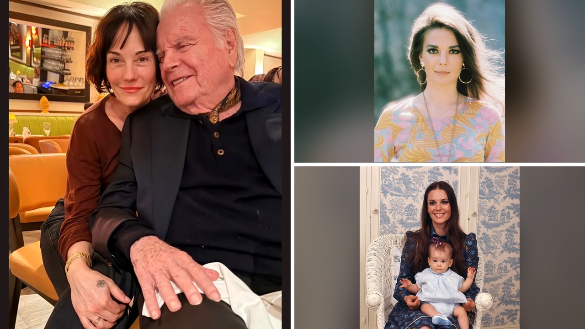

# روبرت واجنر يظهر مع ابنة ناتالي وود ويثير لغز رحيلها

هل يمكن لصورة عائلية دافئة أن تعيد فتح ملف غامض ظل معلقاً لعقود؟ أنا شخصياً استوقفتني صورة نشرها الممثل روبرت واجنر، البالغ من العمر ستة وتسعين عاماً، بمناسبة عيد ميلاد ابنته بالتبني ناتاشا السادس والخمسين. ناتاشا هي الابنة الكبرى للنجمة الراحلة ناتالي وود، والشبه بين الابنة وأمها مذهل لدرجة تجعلك تدقق النظر مرتين. قصة هذه العائلة ليست مجرد ألبوم ذكريات عابر، بل تحمل خلفها واحدة من أكثر الوقائع إثارة للحيرة في تاريخ السينما.

## ملامح لا تخطئها العين
في تلك اللقطة النادرة داخل أحد المطاعم، تظهر ناتاشا بابتسامة عريضة وقصة شعر قصيرة تشبه تماماً إطلالة والدتها الأيقونية، بينما يجلس واجنر بجوارها مرتدياً سترة سوداء مع قميص أسود. الممثل عبّر في منشوره عن فخره الكبير بالمرأة التي أصبحت عليها، متمنياً لها عيد ميلاد سعيداً باسمه وباسم زوجته الحالية جيل سانت جون. ناتاشا وُلدت عام 1970 لوالدتها ناتالي وزوجها السابق المنتج البريطاني ريتشارد جريجسون، قبل أن يتبناها واجنر قانونياً في وقت لاحق.

تخيّلوا تشابك هذه العلاقات الأسرية المليئة بالتحولات! واجنر وناتالي وود تزوجا للمرة الأولى عام 1957، ثم وقع الانفصال عام 1962، ليعودا ويتزوجا مجدداً في عام 1972. أنجب الثنائي ابنتهما كورتني، التي تبلغ اليوم اثنين وخمسين عاماً، بينما لدى واجنر ابنة أخرى تدعى كيتي، تبلغ اثنين وستين عاماً، من زواجه الثاني بالممثلة ماريون مارشال، قبل أن يرتبط بزوجه الحالية جيل سانت جون عام 1990 بعد رحيل وود.

## لغز تلك الليلة في عرض البحر
بصراحة، لا يمكن لأحد أن يرى هذه الملامح دون أن يستحضر تلك الليلة المأساوية عام 1981. ناتالي وود فارقت الحياة غرقاً عن عمر ناهز ثلاثة وأربعين عاماً، أثناء وجودها على متن يخت برفقة زوجها واجنر والممثل كريستوفر واكن. في البداية اعتُبر الحادث غرقاً عرضياً، لكن التطورات اللاحقة قلبت الموازين، خصوصاً في عام 2012 حين عُدّلت شهادة الوفاة لتسجل السبب كغرق وعوامل أخرى غير محددة.

الأمر تعقد أكثر في عام 2018 حين أعلن المحقق رالف هيرنانديز أن واجنر بات شخصاً محل اهتمام في التحقيقات، استناداً إلى شهود زعموا وقوع مشادة بين الزوجين عند حافة القارب قبل اختفائها. المسؤول الأمني هوجو ريناجا أوضح آنذاك أن خيوط القضية استُنفدت وما زالت مفتوحة دون حل نهائي، وستُعاد متابعتها لو ظهرت أدلة جديدة. حتى شقيقة الراحلة، لانا وود، أكدت في تصريحات لاحقة اقتناعها بمسؤوليته عن الحادث رغم استبعادها لفكرة التدبير المسبق، معتبرة أنه مش معقول ألا يكون متورطاً في تلك الواقعة.

## بين والدين وظلال الماضي
ناتاشا كانت طفلة لم تتجاوز الحادية عشرة حين فُجعت بوفاة والدتها. ما فاجأني في حديثها هو نبرة الامتنان العالية؛ إذ أوضحت أنها حظيت بمساندة استثنائية من والدها البيولوجي جريجسون وزوج والدتها واجنر، اللذين تكاتفا تماماً وجعلا مصلحتها في المقام الأول. لقد وفرا لها جلسات دعم نفسي متخصصة في بيفرلي هيلز استمرت مع المعالج نفسه حتى بلغت العشرينيات من عمرها.

هالسالفة تجعلنا أمام صورة مركبة للغاية تتداخل فيها المشاعر الإنسانية مع التحقيقات الرسمية. رأيي الشخصي أن روبرت واجنر يجسد حالة نادرة لرجل يعيش بين مسارين متناقضين؛ فهو في نظر ابنته أب حنون وفّر لها الأمان والاستقرار بعد فاجعة مدمرة، بينما تظل الشبهات حول تلك الليلة الغامضة تطارده في السجلات العامة دون إغلاق نهائي. وش رايكم أنتم، هل تكفي محبة الأبناء لتغيير نظرة العالم تجاه قضايا لم تحسمها التحقيقات؟
