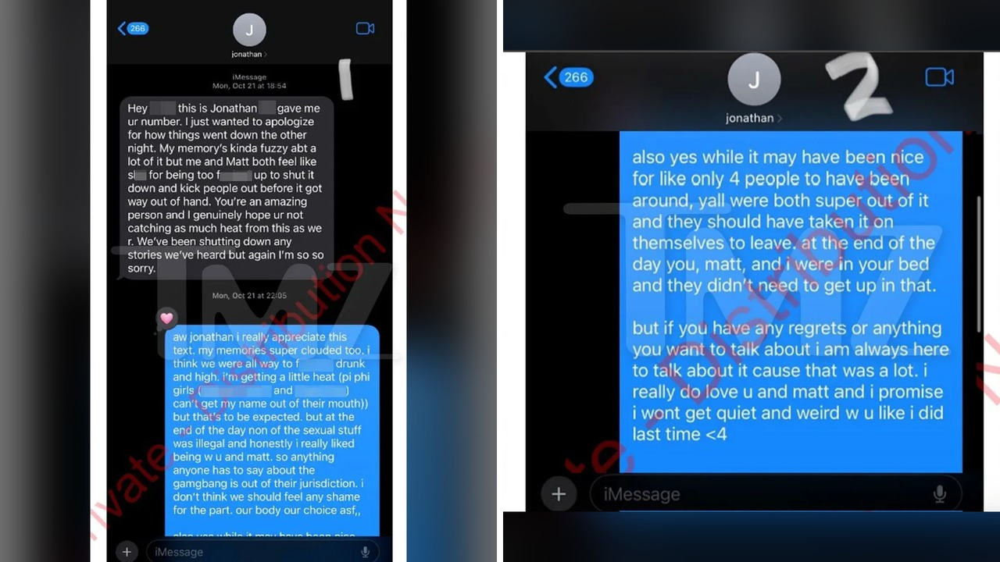

# رسائل جديدة تكشف تفاصيل صادمة في قضية كورنيل

تخيّل أن تقرأ محادثة نصية بين شخصين، طرف يطمئن الآخر بكل هدوء بعد ليلة صاخبة ويخبره ألا يشعر بأي ذنب، ثم تكتشف بعد أسابيع قليلة أن تلك المحادثة بعينها أصبحت قلب قضية مدوية تتضمن اتهامات صريحة بالاغتصاب الجماعي والاعتداء الجنسي داخل واحدة من أشهر الجامعات الأمريكية؟ هذا بالضبط ما استوقفني وأنا أتابع أحدث تفاصيل ما بات يُعرف بقضية طلاب كورنيل السبعة. المراسلات الجديدة التي كُشف عنها أظهرت جانبًا معقدًا ومربكًا للغاية، حيث تتبدل المشاعر وتتناقض الكلمات، وتتحول ليلة يفترض أنها لقاء شبابي إلى ساحة تحقيق جنائي ودعاوى قضائية تطارد سبعة طلاب سابقين.

بحسب ما نُشر حول هذه القضية، تعود الواقعة إلى العشرين من أكتوبر عام ألفين وأربعة وعشرين، داخل أحد منازل الأخوية الطلابية التابعة لجامعة كورنيل. في اليوم التالي مباشرة، بدأت المراسلات بين الشاكية المعروفة باسم جين دو، وأحد المتهمين وهو جوناثان نويل. المثير للدهشة، أو ما فاجأني بصراحة في تلك النصوص، هو النبرة الودية التامة في البداية. نويل بدأ الحديث بالاعتذار عما آلت إليه الأمور، موضحًا أنه وزميله ماثيو إنغالز يشعران بالسوء الشديد لأن حالتهما العقلية تلك الليلة لم تسمح لهما بالسيطرة على الموقف وطرد الآخرين من الغرفة قبل أن تخرج الأمور عن السيطرة، مشيرًا إلى أن ذاكرته كانت مشوشة للغاية، ومؤكدًا أنهما يحاولان إسكات أي شائعات انتشرت في السكن.

رد الفتاة كان صادمًا بالنظر إلى ما حدث لاحقًا. كتبت له أنها تقدر رسالته، وأن ذكرياتها هي الأخرى ضبابية بسبب الإفراط في تعاطي الكحول والمخدرات. لم تتوقف عند هذا الحد، بل طمأنته بأن ما جرى لم يكن غير قانوني، وأنها كانت تستمتع بوجودها معه ومع زميله ماثيو، بل استخدمت عبارة صريحة مفادها ألا داعي للشعور بالعار لأن أجسادنا هي خيارنا. واسترجعت لحظات وصفتها بالجنونية، بما فيها تعاطي مادة الكيتامين. محامي الفتاة علّق لاحقًا على هذه الرسائل بالذات، معتبرًا أنها لم تكن سوى محاولة نفسية للتعامل مع الصدمة، مرحلة من الإنكار والشعور بالخجل وصولًا إلى الإدراك التام لما جرى.

## التحول الجذري وإنكار الرضا الكامل

كيف يمكن لموقف واحد أن يتبدل بهذا الشكل الجذري في ظرف ثلاثة أسابيع فقط؟ هذا السؤال لا يفارق ذهني منذ قرأت المراسلات اللاحقة. العلاقة بين الأطراف بدأت تتدهور تدريجيًا حتى وصلت إلى نقطة الانفجار في الثالث من نوفمبر. هنا، أرسلت الشابة رسالة مختلفة كليًا إلى نويل، أوضحت فيها بحزم أن تسعين بالمئة مما حدث تلك الليلة لم يكن برضاها على الإطلاق. قالت له إنها تلقت كميات من الكيتامين تفوق قدرتها على التذكر، وإنها أعربت وقتها عن عدم ارتياحها لوجود أشخاص غرباء لا تعرفهم داخل الغرفة.

وفق ما ورد في التقرير، أكدت الفتاة أنها شعرت بالعجز التام عن المقاومة بعد تعاطي الكحول والمواد المخدرة التي قُدمت لها في مقر الأخوية، مما أفقدها القدرة على صد الطلاب الذين توافدوا على الغرفة بالتناوب لمشاركتها الجنس. نويل من جهته كرر الرد ذاته تقريبًا، مؤكدًا أنه لا يذكر حدوث تلك التفاصيل إطلاقًا، وأنه لو كان في وعيه لحظة دخول الطلاب لطردهم على الفور.

يا جماعة، هذا التناقض الحاد بين رسائل اليوم التالي ورسائل الأسابيع اللاحقة يوضح عمق التعقيد الذي يحيط بقضايا الاعتداء في الحرم الجامعي، خاصة حين ترتبط باحتساء الكحول وفقدان الإدراك.

## محادثة داخلية تفتح باب التحقيقات مجددا

الأمر لم يتوقف عند الرسائل الثنائية بينهما. في البداية، رفض مكتب المدعي العام المحلي توجيه أي اتهامات جنائية ضد الطلاب، مستندًا إلى إفادة سابقة للفتاة أمام شرطة الحرم الجامعي، حيث أشار الادعاء إلى أنها لم تتهم أحدًا بالاغتصاب حينها، وأنها تناولت الكحول والمواد المخدرة بإرادتها طوال الليل. مش معقول كيف كانت القضية في طريقها للإغلاق، قبل أن تشتعل مجددًا في سبتمبر عندما رفعت الشاكية دعوى قضائية رسمية تتهم سبعة طلاب بالاغتصاب والاعتداء الجنسي.

الدعوى تضمنت عنصرًا قلب الموازين تمامًا، وهو وجود محادثة جماعية سرية بين أعضاء الأخوية. الشكوى زعمت أن نويل كتب في تلك المجموعة رسائل مسيئة تدعو الزملاء للصعود إلى الطابق العلوي والمشاركة معها، وهو ما تسبب في توافد الشبان إلى الغرفة واحدًا تلو الآخر. هذه المراسلات الجماعية هي التي بنت عليها المدعية دعواها بأن ما حصل كان اعتداءً منظمًا واستغلالًا لعجزها عن الحركة والرفض. ومع خروج هذه المزاعم إلى العلن، اندلعت احتجاجات واسعة تطالب بمحاسبة الطلاب ومراجعة طريقة التعامل مع بلاغات الاعتداء في الجامعات، مما دفع جهات التحقيق لإعادة فتح الملف من جديد.

هل مرّ عليك تحليل نفسي يفسر إنكار الضحية لصدمتها في اللحظات الأولى بعد وقوعها؟ الصراحة، هالسالفة تجعلني أتأمل في خطورة تلك الأجواء الجامعية التي تختلط فيها المغيبات الذهنية بالسلوكيات المتهورة دون أدنى حس بالمسؤولية.

رأيي الشخصي أن مثل هذه المراسلات تظهر حجم الضياع الذي يتسبب فيه غياب الوعي، وأرى أن تعليق المحامي حول مراحل الصدمة والإنكار يعكس محاولة لتفسير التناقض الكبير في سلوك الشاكية، بينما تظل تلك الرسائل الجماعية، إن ثبتت صحتها، دليلًا على انحدار أخلاقي وسلوك لا يمكن تبريره بأي مبرر. وش رايكم أنتم في هذه التطورات، وهل ترون أن الرسائل الأولى قد تؤثر على مسار العدالة في المحكمة؟
