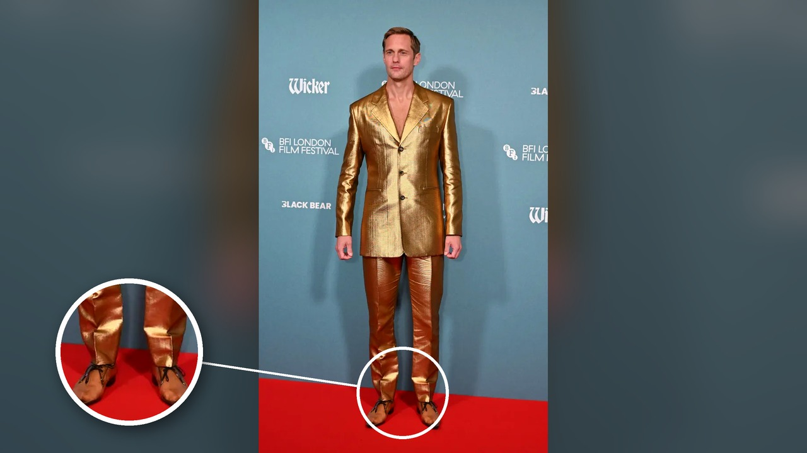

# حذاء ألكسندر سكارسغارد الشفاف يثير الجدل في لندن

تخيل أن تحضر مناسبة رسمية ببدلة مذهبة تخطف الأبصار، لكن الحضور يتجاهلون أناقتك بالكامل ويركزون على أصابع قدميك! هذا تماماً ما قرأته عن النجم السويدي ألكسندر سكارسغارد أثناء حضوره مهرجان لندن السينمائي. الممثل البالغ من العمر خمسين عاماً قرر لفت الأنظار بقوة أثناء الترويج لعمله الجديد. الصراحة، ما طالعته في تفاصيل الخبر جعلني أتساءل بفضول: إلى أين تتجه صيحات الموضة العالمية؟

## بدلة مذهبة وتصميم صادم
في العرض الأول لفيلم ويكر يوم الخميس، ظهر ألكسندر مرتدياً بدلة ذهبية لافتة من دار سان لوران دون قميص أسفلها. لكن تلك البدلة لم تكن محور الحديث الرئيسي. كل الأنظار توجهت نحو الأسفل، حيث انتعل حذاءً غريباً مصنوعاً بالكامل من البلاستيك الشفاف من الدار نفسها، مظهراً أصابع قدميه بوضوح أمام عدسات المصورين. هذا الحذاء أحدث ضجة منذ ظهوره لأول مرة على منصات العرض في يونيو الماضي، ليصبح سكارسغارد أول رجل يجرؤ على استعراضه علناً بهذا الشكل. هل كنت لتجرؤ على ارتداء حذاء شفاف كهذا؟

## انقسام حاد ومخاوف عملية
ردود الأفعال التي قرأتها بين المتابعين كانت منقسمة بحدة، يا جماعة. جزء من المعجبين امتدح شجاعته وأثنى على ثقته بنفسه، مؤكدين أنه يمتلك حضوراً يجعله قادراً على ارتداء أي تصميم بنجاح. في المقابل، هاجمه آخرون واعتبروا القطعة منفّرة، بل وعلقت نجمة تلفزيون الواقع السابقة بيج ديسوربو مطالبة بوضع حد لمثل هذه الإطلالات. المثير للاهتمام هو قلق الجمهور من الناحية العملية، فالأحذية البلاستيكية تحبس الرطوبة، وسخر معلقون من احتمالية تراكم العرق والبخار وانبعاث روائح غير مستحبة أثناء السير. مش معقول كيف تحول النقاش الفني السريع إلى مشكلة تعرق داخل الحذاء!

## تاريخ طويل مع الجرأة
الحقيقة أن هذه التجربة ليست سابقة فريدة بالنسبة له، بحسب ما جاء في التقرير. ألكسندر معتاد على الموضة غير التقليدية، وسبق أن ظهر بإطلالات جريئة تناسب شخصيته في فيلم بيليون، شملت سراويل جلدية وملابس قصيرة ومطرزة، كما ارتدى في عام 2025 أحذية جلدية طويلة تصل إلى الفخذ من سان لوران. يبدو أنه يستمتع بإثارة التفاعل بشتى الطرق. ولعل هالسالفة تتكامل مع فكرة فيلمه القادم؛ إذ يلعب دور رجل مصنوع من الخوص يتزوج صيادة سمك تجسدها أوليفيا كولمان في عمل كوميدي يُعرض في الثالث والعشرين من أكتوبر.

## الجرأة مقابل الذوق العام
رأيي الشخصي أن ألكسندر سكارسغارد يعي جيداً كيف تدار التغطيات الإعلامية في هوليوود. هو يدرك أن الظهور بإطلالة كلاسيكية لن يحرك الصحافة والجمهور للحديث عن فيلمه، لذا اعتمد عمداً على صدمة بصرية صنعت ضجة هائلة في دقائق. والآن، وش رايكم في هذه الإطلالة، هل ترونها شجاعة تستحق الإشادة أم مجرد رغبة مبالغ فيها للفت الانتباه؟
