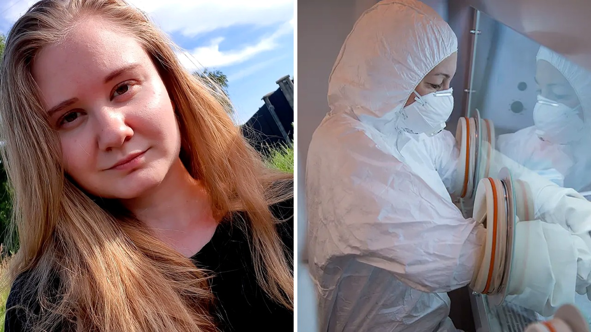

# وفاة عالمة روسية بمرض غامض ووالدتها تكذب الرواية الرسمية

تخيّل أن تعمل داخل مختبر شديد الحراسة للأوبئة الفتاكة، ثم يُقال إنك فقدت حياتك بسبب أنبوب اختبار سقط بالخطأ من يدك. قرأت هذا الخبر واستوقفني كثيرًا؛ باحثة روسية شابة تدعى داريا شيبيلوفا، تبلغ من العمر ثمانية وعشرين عامًا، رحلت في الثاني من أكتوبر بعد إصابتها في معهد أبحاث مكافحة الطاعون في سيبيريا والشرق الأقصى. القصة لم تقف عند هذا الحد، فالصدمة بدأت حين قررت والدتها كسر الصمت ومواجهة الرواية المتداولة.

## رواية الأنبوب المكسور
حسب ما نُشر، ظهرت تقارير تزعم أن داريا أسقطت أنبوبًا يحتوي على العامل الممرض القاتل، ما أدى لوفاتها. غير أن والدتها، سفيتلانا، وهي متخصصة في المجال الطبي، رفضت تلك الفكرة تمامًا. قالت إنها تعرف الحقيقة، وإن كسر مثل هذه الأنابيب أمر مستحيل تقنيًا حتى لو أُلقيت على الحائط لحمايتها الفائقة. واعتبرت أن مجرد ترديد هذا التفسير يأتي من غير المختصين، بل وجهت اتهامًا قاسيًا للمسؤولين بأنهم تركوها تموت ببساطة دون علاج مناسب. هل يعقل أن تمر حادثة في مختبر يتعامل مع الطاعون دون تفاصيل دقيقة؟

## تساؤلات دولية وعلامات استفهام
المثير للدهشة، يا جماعة، أن موسكو اكتفت بالإعلان رسميًا عن وفاة الشابة بسبب التهاب رئوي مجهول المنشأ، بينما وُضع مئات ممن خالطوها في الحجر الصحي. هذا التعتيم فتح باب الشكوك، لا سيما من روبرت ريدفيلد، المدير السابق لمراكز السيطرة على الأمراض والوقاية منها في الولايات المتحدة. ريدفيلد أوضح أنه إذا وقع حادث في مختبر للطاعون، فهناك بروتوكول صارم للعلاج بالمضادات الحيوية، وتساءل: لماذا لم تنجح الأدوية؟ وهل كانت السلالة خاضعة لتعديل جعلها مقاومة للعلاج لاستخدامها كسلاح بيولوجي؟ بصراحة، هالسالفة تطرح قلقًا كبيرًا حول ما يجري خلف الجدران المغلقة.

## رد الكرملين والضغوط المستمرة
في المقابل، أكد المتحدث باسم الكرملين، ديمتري بيسكوف، أن بلاده أبلغت منظمة الصحة العالمية بالواقعة واتبعت جميع المعايير الدولية المعتمدة، متهمًا وسائل الإعلام بنشر معلومات غير دقيقة ومضللة. ورغم هذا النفي، تواصل الولايات المتحدة ومنظمة الصحة العالمية الضغط للحصول على شفافية تامة وكشف حقيقة ما تعرضت له الباحثة.

رأيي الشخصي أن غياب الوضوح في حوادث المختبرات البيولوجية يفتح الباب واسعًا لافتراضات خطيرة، ومن حق عائلة الضحية معرفة ما حدث بدقة. شو رأيك أنت في هذه الاتهامات المتبادلة؟
